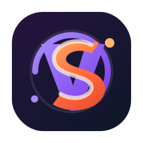

<p align="center">
  <a href="https://vike.dev">
    
  </a>
</p>

<h1 align="center">vike-svelte</h1>

<p align="center">Svelte renderer integration for Vike with SSR, hydration, routing, layouts, and client-only UI.</p>

<p align="center">
  <a href="https://www.npmjs.com/package/vike-svelte"></a>
  <a href="https://github.com/brandonxiang/vike-svelte/issues"></a>
  <a href="https://github.com/brandonxiang/vike-svelte/blob/main/LICENSE"></a>
</p>

Svelte renderer integration for [Vike](https://vike.dev). It provides the Vike V1 renderer hooks, Svelte server rendering, client hydration, client-side routing, layout configuration, and a small client-only component for browser-only UI.

This package targets Svelte 5, Vike 0.4, and Vite 5 or newer.

## ✨ Why This Package

- Use Vike's file-based routing and data lifecycle with Svelte components.
- Render pages on the server with `svelte/server`, then hydrate on the client.
- Configure layouts, document metadata, SSR mode, and client-only islands through Vike config.
- Keep the package small while Svelte parity work continues in public GitHub issues.

## 📦 Installation

```bash
pnpm add vike-svelte vike svelte vite
```

Use `vike-svelte/config` in your Vike config:

```js
// pages/+config.js
import vikeSvelte from 'vike-svelte/config'
import Layout from './Layout.svelte'

export default {
  extends: [vikeSvelte],
  Layout,
  title: 'My Svelte app',
  description: 'A Vike app rendered with Svelte'
}
```

## 🚀 Basic Page

```svelte
<!-- pages/index/+Page.svelte -->
<h1>Vike + Svelte</h1>
<p>This page is server-rendered and hydrated by vike-svelte.</p>
```

Use Svelte's native head support for component-local metadata:

```svelte
<svelte:head>
  <title>Dashboard</title>
  <meta name="description" content="Dashboard page" />
</svelte:head>
```

## 🧭 Reading Page Context

`vike-svelte` exposes public hooks for reading Vike data from Svelte components.

```svelte
<script>
  import { usePageContext } from 'vike-svelte/usePageContext'

  const pageContext = usePageContext()
</script>

<p>{pageContext.urlPathname}</p>
```

Use `useData()` when a page only needs `pageContext.data`.

```svelte
<script>
  import { useData } from 'vike-svelte/useData'

  const data = useData()
</script>
```

## 🏷️ Dynamic Page Config

Use `useConfig()` when a Svelte component needs to set Vike-backed document metadata during SSR and client navigation.

```svelte
<script>
  import { useConfig } from 'vike-svelte/useConfig'

  useConfig({
    title: 'Dashboard',
    description: 'Team dashboard',
    lang: 'en'
  })
</script>
```

For declarative component usage, import `vike-svelte/Config`.

```svelte
<script>
  import Config from 'vike-svelte/Config'
</script>

<Config title="Dashboard" description="Team dashboard" />
```

Use Svelte's `<svelte:head>` for component-local tags that do not need to flow through Vike config. Use `useConfig()` or `<Config />` for title, description, language, and favicon values that should be visible to the renderer.

## 🧩 Client-Only Components

Use `vike-svelte/clientOnly` when a component depends on browser APIs and should not render during SSR.

```svelte
<script>
  import ClientOnly from 'vike-svelte/clientOnly'
  import BrowserChart from './BrowserChart.svelte'
  import ChartFallback from './ChartFallback.svelte'
</script>

<ClientOnly
  target={BrowserChart}
  componentProps={{ theme: 'dark' }}
  fallback={ChartFallback}
/>
```

The current API uses `target`, `componentProps`, and `fallback`. Client-only parity with `vike-react` is tracked in [issue #22](https://github.com/brandonxiang/vike-svelte/issues/22).

## ⚙️ Supported Config

The renderer currently declares these Vike config entries:

| Config | Status |
| --- | --- |
| `Layout` | Supported, cumulative parity work tracked in [#20](https://github.com/brandonxiang/vike-svelte/issues/20) |
| `Head` | Declared, dynamic head/config API tracked in [#18](https://github.com/brandonxiang/vike-svelte/issues/18) |
| `Wrapper` | Declared, renderer application tracked in [#20](https://github.com/brandonxiang/vike-svelte/issues/20) |
| `title` | Supported through renderer title output |
| `description` | Supported through renderer description output |
| `favicon` | Supported through renderer favicon output |
| `lang` | Supported through `<html lang>` |
| `ssr` | Supported through the renderer config effect |
| `stream` | Not supported yet; the renderer returns full Svelte `render()` output. See [#21](https://github.com/brandonxiang/vike-svelte/issues/21) |
| `viewport` | Declared, renderer output tracked in [#19](https://github.com/brandonxiang/vike-svelte/issues/19) |
| `htmlAttributes` | Declared, renderer output tracked in [#19](https://github.com/brandonxiang/vike-svelte/issues/19) |
| `bodyAttributes` | Declared, renderer output tracked in [#19](https://github.com/brandonxiang/vike-svelte/issues/19) |
| `onAfterRenderClient` | Declared for client runtime hooks |

Example:

```js
export default {
  viewport: 'width=device-width, initial-scale=1',
  htmlAttributes: {
    'data-renderer': 'vike-svelte'
  },
  bodyAttributes: {
    'data-app-shell': 'default'
  }
}
```

`Wrapper` entries render outside `Layout` entries. Cumulative entries compose in their resolved config order, then the page component renders at the center of the stack.

## 🧱 Parity With vike-react

`vike-svelte` is not yet feature-equivalent with `vike-react`. The current work is split into executable issues:

| Area | Issue |
| --- | --- |
| Public runtime hooks | `usePageContext()` and `useData()` are supported. See [#17](https://github.com/brandonxiang/vike-svelte/issues/17) |
| Dynamic head and config APIs | `useConfig()` and `<Config />` are supported. See [#18](https://github.com/brandonxiang/vike-svelte/issues/18) |
| Renderer output for declared config | `viewport`, `htmlAttributes`, and `bodyAttributes` are supported. See [#19](https://github.com/brandonxiang/vike-svelte/issues/19) |
| Cumulative `Layout` and `Wrapper` behavior | Cumulative composition is supported. See [#20](https://github.com/brandonxiang/vike-svelte/issues/20) |
| Streaming support decision | Streaming is intentionally deferred. See [#21](https://github.com/brandonxiang/vike-svelte/issues/21) |
| Client-only static removal behavior | [#22](https://github.com/brandonxiang/vike-svelte/issues/22) |
| Parity matrix and ecosystem examples | [#23](https://github.com/brandonxiang/vike-svelte/issues/23) |

The original audit is available in [issue #16](https://github.com/brandonxiang/vike-svelte/issues/16).

For a fuller feature matrix and Svelte ecosystem plan, see [docs/parity.md](docs/parity.md).

## 🧪 Examples

- [Minimal example](examples/minimal)
- [Full example](examples/full)

Run an example locally:

```bash
cd examples/minimal
pnpm install
pnpm run dev
```

## 🛠️ Development

```bash
pnpm install
pnpm run build
```

The package source lives in `packages/vike-svelte`. Examples use the local package through the workspace override in the root `package.json`.

## 📄 License

[MIT](LICENSE)
